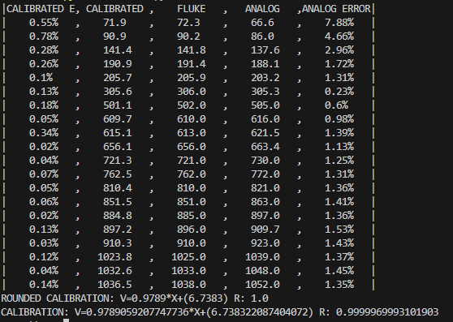

# Sobre  
Analisa os dados e realiza uma regressão linear nas tensões obtidas pelo multímetro Fluke115 e pelo Arduino.  
Utiliza o [PyTable](https://github.com/daguerpedro/pythontable) para imprimir os dados no console.  
Utiliza o [SciPy](https://scipy.org/) para fazer a regressão linear.  
Utilizar o [pandas](https://pandas.pydata.org/) para ler o arquivo CSV. 

